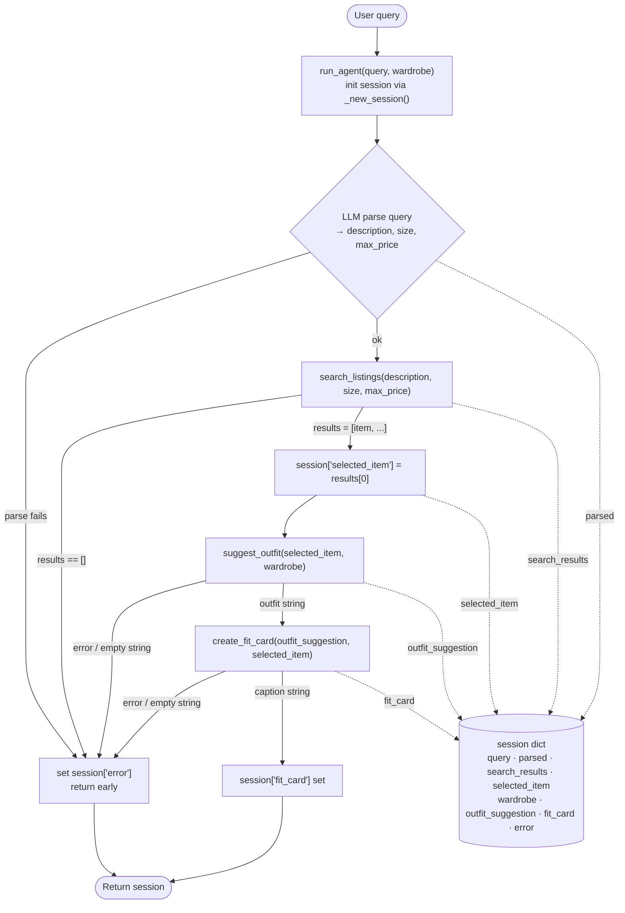

# FitFindr — planning.md

> Complete this document before writing any implementation code.
> Your spec and agent diagram are what you'll use to direct AI tools (Claude, Copilot, etc.) to generate your implementation — the more specific they are, the more useful the generated code will be.
> Your planning.md will be reviewed as part of your submission.
> Update it before starting any stretch features.

---

## Tools

List every tool your agent will use. For each tool, fill in all four fields.
You must have at least 3 tools. The three required tools are listed — add any additional tools below them.

### Tool 1: search_listings

**What it does:**
<!-- Describe what this tool does in 1–2 sentences -->

Search the listings for items matching the specified description, size, and max price.

**Input parameters:**
<!-- List each parameter, its type, and what it represents -->
- `description` (str): keywords matching what outfit the user is looking for
- `size` (str): size to filter by, or None to skip this filter
- `max_price` (float): max price to filter by, or None to skip this filter

**What it returns:**
<!-- Describe the return value — what fields does a result contain? -->
A list of matching listing dicts, each with `id`, `title`, `description`, `category`, `style_tags` (list), `size`, `condition`, `price` (float), `colors` (list), `brand`, `platform`.

**What happens if it fails or returns nothing:**
<!-- What should the agent do if no listings match? -->
Returns `[]` if no matches were found.

---

### Tool 2: suggest_outfit

**What it does:**
<!-- Describe what this tool does in 1–2 sentences -->
Suggests complete outfit pairing based on a provided `new_item` with the user's wardrobe.

**Input parameters:**
<!-- List each parameter, its type, and what it represents -->
- `new_item` (dict): selected listing dict for the item the user is considering.
- `wardrobe` (dict): a wardrobe dict

**What it returns:**
<!-- Describe the return value -->
Non-empty `str` with outfit suggestions.

**What happens if it fails or returns nothing:**
<!-- What should the agent do if the wardrobe is empty or no outfit can be suggested? -->
If the wardrobe is empty, offer general styling advice for `new_item`. If no outfit can be suggested, fail gracefully with an error message.

---

### Tool 3: create_fit_card

**What it does:**
<!-- Describe what this tool does in 1–2 sentences -->
Generate a 2-4 sentence social media caption for the `new_item`.

**Input parameters:**
<!-- List each parameter, its type, and what it represents -->
- `outfit` (str): outfit suggestions returned by `suggest_outfit` 
- `new_item` (dict): selected listing dict for the item the user is considering.

**What it returns:**
<!-- Describe the return value -->
A short caption `str` for sharing

**What happens if it fails or returns nothing:**
<!-- What should the agent do if the outfit data is incomplete? -->
If the outfit data is incomplete, fail gracefully with an error message.

---

### Additional Tools (if any)

<!-- Copy the block above for any tools beyond the required three -->

---

## Planning Loop

**How does your agent decide which tool to call next?**
<!-- Describe the logic your planning loop uses. What does it look at? What conditions change its behavior? How does it know when it's done? -->

1. Initialize the session with `_new_session()`.

2. Parse the user query to extract `description`, `size`, and `max_price` using LLM. Store the parameters in `session["parsed"]`.

   If the parameter could not be parsed, set `session["error"]` to "Sorry, I don't understand your query. Please try again" and return early.

3. Call `search_listings` with the parsed parameters. Store the results in `session["search_results"]`.

   If `search_listings` returns no results, set `session["error"]` to "Sorry, no listings matched your description, size, and budget." and return early.

4. Set `session["selected_item"]` to `results[0]`, i.e., the first item. Call `suggest_outfit` with the selected item and wardrobe. Store the result in `session["outfit_suggestion"]`.

   If `suggest_outfit` results in an error or returns an empty string, set `session["error"]` to "Sorry, an error has occurred." and return early.

5. Call `create_fit_card` with the outfit suggestion and selected item. Store the result in `session["fit_card"]`.

   If `create_fit_card` results in an error or returns an empty string, set `session["error"]` to "Sorry, an error has occurred." and return early.

6. Return the session.

---

## State Management

**How does information from one tool get passed to the next?**
<!-- Describe how your agent stores and accesses state within a session. What data is tracked? How is it passed between tool calls? -->

We use a `session` dict to share information among tools.

The `session` dict tracks the following data:

* `query`
* `parsed`
* `search_results`
* `selected_item`
* `wardrobe`
* `outfit_suggestion`
* `fit_card`
* `error`

Each tool's output is written to session before the next reads it.

---

## Error Handling

For each tool, describe the specific failure mode you're handling and what the agent does in response.

| Tool | Failure mode | Agent response |
|------|-------------|----------------|
| search_listings | No results match the query | Returns early with a graceful error message "Sorry, no listings matched your description, size, and budget." |
| suggest_outfit | Wardrobe is empty | Provides generic advice based on the selected item only. |
| create_fit_card | Outfit input is missing or incomplete | Returns with a graceful error message, e.g., "Sorry, an error has occurred." |

---

## Architecture

<!-- Draw a diagram of your agent showing how the components connect:
     User input → Planning Loop → Tools (search_listings, suggest_outfit, create_fit_card)
                                                                          ↕
                                                                   State / Session
     Show what triggers each tool, how state flows between them, and where error paths branch off.
     ASCII art, a Mermaid diagram (https://mermaid.js.org/syntax/flowchart.html), or an embedded
     sketch are all fine. You'll share this diagram with an AI tool when asking it to implement
     the planning loop and each individual tool. -->

---

## AI Tool Plan

<!-- For each part of the implementation below, describe:
     - Which AI tool you plan to use (Claude, Copilot, ChatGPT, etc.)
     - What you'll give it as input (which sections of this planning.md, your agent diagram)
     - What you expect it to produce
     - How you'll verify the output matches your spec before moving on

     "I'll use AI to help me code" is not a plan.
     "I'll give Claude my Tool 1 spec (inputs, return value, failure mode) and ask it to implement
     search_listings() using load_listings() from the data loader — then test it against 3 queries
     before trusting it" is a plan. -->

**Milestone 3 — Individual tool implementations:**

I will use Claude, one tool at a time.

- **search_listings**

   I will give Claude my Tool 1 spec block plus the `load_listings()` signature from `utils/data_loader.py`, and ask it to implement `search_listings()` in `tools.py`.

   I will confirm it filters on all three parameters and returns `[]` for an impossible query, then test different combinations of queries, ensuring the results match my expectations.

- **suggest_outfit**

   I will give Claude my Tool 2 spec plus a note to call Groq `llama-3.3-70b-versatile` using `GROQ_API_KEY` from `.env`. I expect a function that formats the wardrobe items into a prompt and returns the LLM's suggestion, with a branch that asks for general advice when `wardrobe['items']` is empty.

   I will verify by calling it once with the example wardrobe and once with the empty wardrobe and confirming both return a non-empty string and neither raises errors.

- **create_fit_card**

   I will give Claude my Tool 3 spec plus the same Groq note and an instruction to use a higher temperature so outputs vary.
   
   I will verify the guard (empty `outfit` string returns an error-message string, not an exception) and that calling it twice on the same item produces different captions.

**Milestone 4 — Planning loop and state management:**

I will use Claude. I will give it my **Planning Loop**, **State Management**, and the **Architecture** sections, and ask it to implement `run_agent()` in `agent.py` following those steps.

I expect it to: parse the query, branch and return early when `search_listings` returns `[]`, store every intermediate result in the `session` dict, and call `suggest_outfit`/`create_fit_card` only on the happy path.

I will verify against the diagram:

1. run the happy-path query and confirm `session["selected_item"]` is the exact dict passed into `suggest_outfit`, and `session["outfit_suggestion"]` is what went into `create_fit_card`

2. run the no-results query (`"designer ballgown", "XXS", 5`) and confirm `session["error"]` is set and `session["fit_card"]` stays `None`, i.e., the later tools were never called.

Then, I will give Claude the `handle_query()` TODO in `app.py` and have it map the session dict to the three output panels, verifying the error path shows the message in the first panel and leaves the other two empty.

---

## A Complete Interaction (Step by Step)

FitFindr takes a natural-language request from user and calls three tools in order. A user query triggers `search_listings`, which filters the listings by description, size, and price. The top match flows into `suggest_outfit`, which pairs it against the user's wardrobe. The suggestion flows into `create_fit_card`, which writes a shareable caption. If `search_listings` returns nothing, the agent stops and tells the user instead of calling the later tools with empty input.

Write out what a full user interaction looks like from start to finish — tool call by tool call. Use a specific example query.

**Example user query:** "I'm looking for a vintage graphic tee under $30. I mostly wear baggy jeans and chunky sneakers. What's out there and how would I style it?"

**Step 1:**
<!-- What does the agent do first? Which tool is called? With what input? -->
The agent parses the user query and calls `search_listings("vintage graphic tee", size=None, max_price=30.0)`.

**Step 2:**
<!-- What happens next? What was returned from step 1? What tool is called now? -->
`search_listings` returns 3 results. FitFindr picks the top result: *"Y2K Baby Tee — Butterfly Print, $18, Depop, Excellent condition."*

The agent then calls `suggest_outfit(new_item=<Y2K Baby Tee — Butterfly Print>, wardrobe=<user's wardrobe>)` with the selected item and the user's wardrobe.

**Step 3:**
<!-- Continue until the full interaction is complete -->
`suggest_outfit` returns the suggestion *"Pair this Y2K baby tee with your baggy jeans and chunky sneakers for an effortless early-2000s streetwear look. Let the butterfly print be the focal point, and add a loose half-tuck at the front to give the outfit a bit more shape while keeping the relaxed vibe."*

The agent then calls `create_fit_card(outfit=<suggestion>, new_item=<Y2K Baby Tee — Butterfly Print>)`.

**Final output to user:**
<!-- What does the user actually see at the end? -->
A fit card with *"thrifted this butterfly baby tee off depop for $18 and it was basically made for my baggy jeans 🦋✨ keeping it simple with chunky sneakers today. full fit in my stories"*.